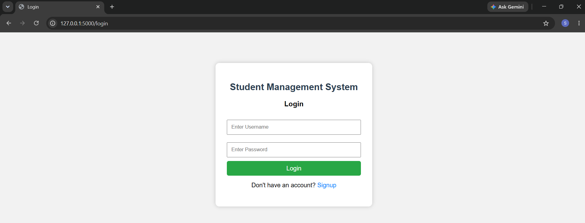
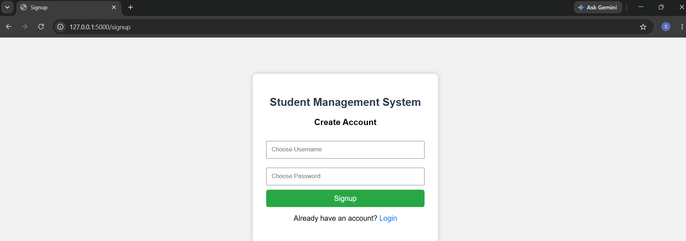
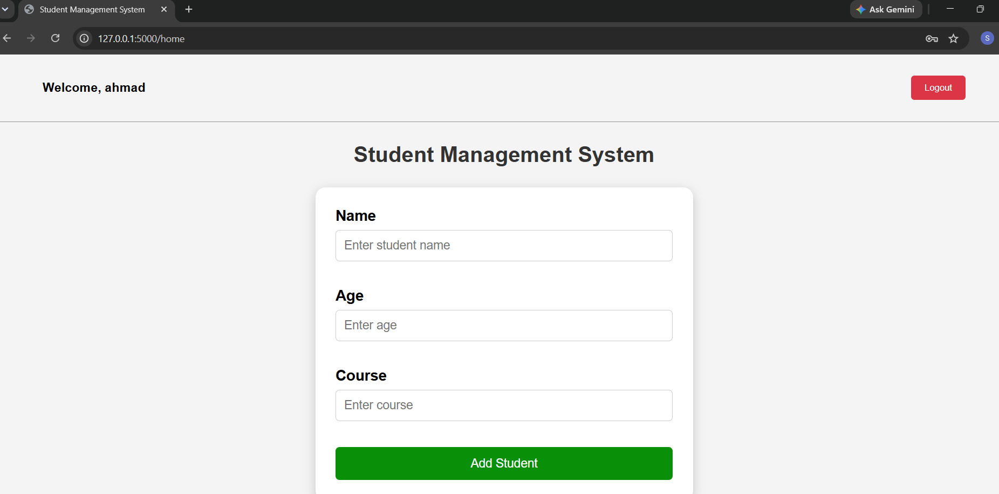
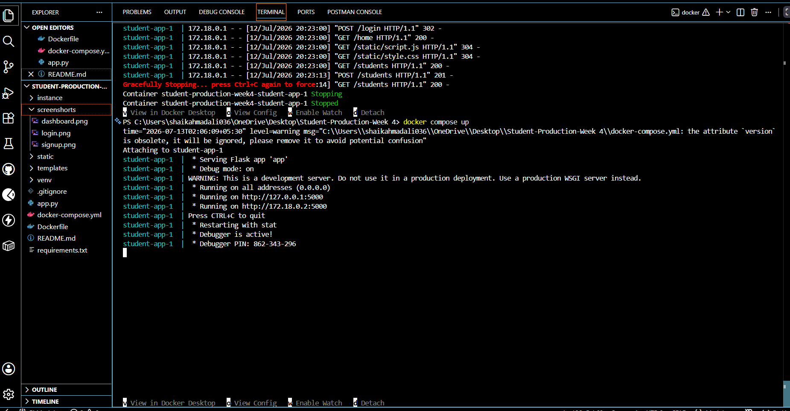

# 🎓 Student Management System (Production Ready)

A production-ready Student Management System built using **Flask**, **SQLite**, **Flask-Login**, and **Docker**. This project provides secure user authentication and complete CRUD operations for managing student records.

---

## 🚀 Features

### 🔐 Authentication
- User Signup
- User Login
- User Logout
- Password Hashing
- Session-based Authentication
- Protected Routes

### 👨‍🎓 Student Management
- Add Student
- View Students
- Edit Student
- Delete Student

### 🐳 Production Ready
- Docker Support
- Docker Compose
- Requirements File
- Clean Project Structure
- Documentation

---

## 🛠️ Technologies Used

- Python
- Flask
- Flask-Login
- Flask-SQLAlchemy
- SQLite
- HTML5
- CSS3
- JavaScript
- Docker
- Docker Compose
- Git & GitHub

---

## 📁 Project Structure

```
Student-Production-Week4/
│
├── static/
├── templates/
├── instance/
├── screenshots/
├── app.py
├── requirements.txt
├── Dockerfile
├── docker-compose.yml
├── .gitignore
└── README.md
```

---

## ⚙️ Installation

### Clone Repository

```bash
git clone https://github.com/ShaikAhmadali/Student-Production-Week4.git
```

```bash
cd Student-Production-Week4
```

---

### Install Dependencies

```bash
pip install -r requirements.txt
```

---

### Run the Application

```bash
python app.py
```

Open:

```
http://127.0.0.1:5000
```

---

# 🐳 Run with Docker

Build the Docker image

```bash
docker compose build
```

Run the application

```bash
docker compose up
```

Open

```
http://127.0.0.1:5000
```

---

# 📷 Screenshots

## Login



---

## Signup



---

## Dashboard



---

## Docker Running



---

# 🔒 Authentication Flow

- Signup
- Login
- Session Created
- Protected Dashboard
- CRUD Operations
- Logout
- Session Destroyed

---

# 🎯 Future Improvements

- Search Students
- Pagination
- User Profile
- Password Reset
- Email Verification
- Deployment on Render/AWS

---

# 👨‍💻 Author

**Shaik Ahmadali**

GitHub:
https://github.com/ShaikAhmadali

LinkedIn:
https://www.linkedin.com/in/shaik-ahmadali

---

⭐ If you like this project, don't forget to give it a star!